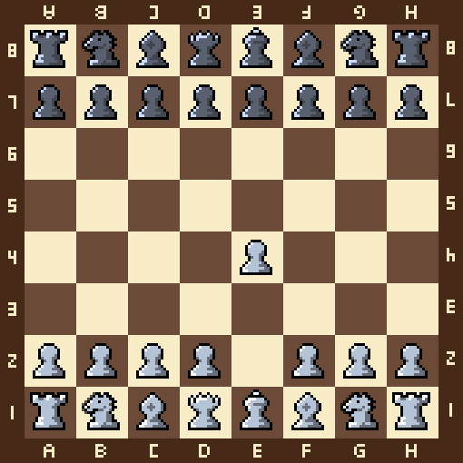

# Fenpix Library

Fenex is a Rust library for converting fen string into pixel chess boards.

The pixel assets were designed by me, so you're free to use them as you like.

## Features

As of writing, This the library only has one function.

It converts fen string ex. "rnbqkbnr/pppppppp/8/8/8/8/PPPPPPPP/RNBQKBNR"

into a pixel art chess board.



## Usage

Using it is pretty simple.

```rust
// import the fen_to_pixel_board function from the crate.
use fenix::fen_to_pixel_board;

// The function fen_to_pixel_board takes 3 parameters.
// The fen string, The image output directory and The upscale multiplier.
fn example() {
fen_to_pixel_board("rnbqkbnr/pppppppp/8/8/8/8/PPPPPPPP/RNBQKBNR", "chess_board.png", 1);
}


```
